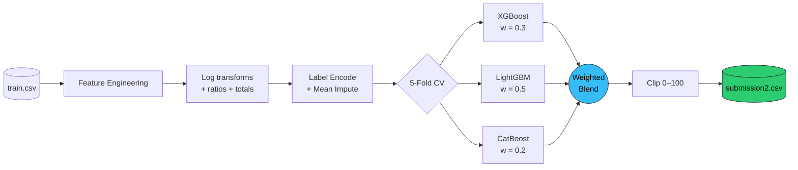
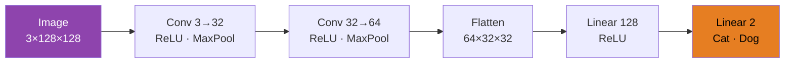
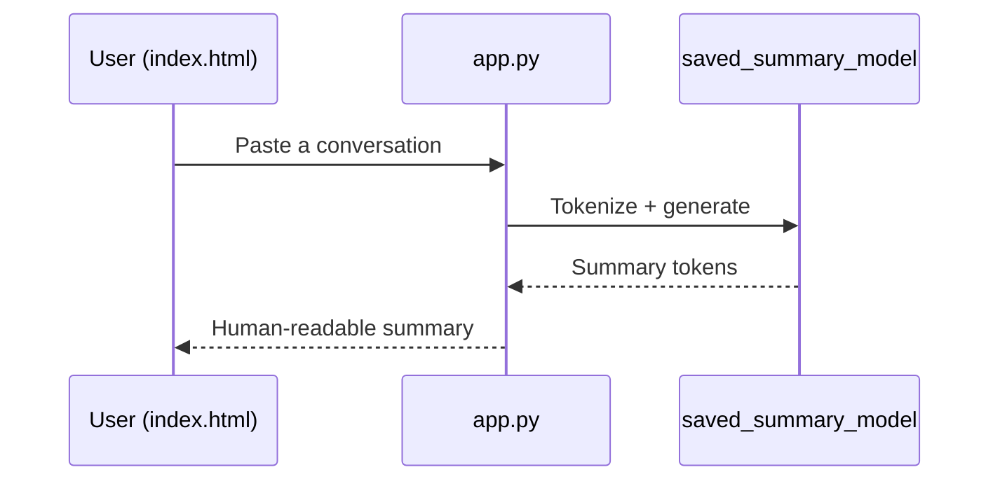

<div align="center">


<a href="https://git.io/typing-svg">
  
</a>

<br/>


</div>

---

## 🧭 What is this?

A curated lab of **focused machine learning projects**, each one small enough to finish and deep enough to teach something real. Together they span the main branches of modern ML:

| Branch | Project | Core idea |
|:--|:--|:--|
| 📊 **Supervised / Tabular** | ModelForge CPU Prediction | Feature engineering + boosted-tree ensemble |
| 👁️ **Computer Vision** | Cats vs Dogs CNN | Convolutions on 128×128 images |
| 🎮 **Reinforcement Learning** | Q-Learning & SARSA on CliffWalking | Off-policy vs on-policy control |
| 💬 **NLP** | Text Summarizer AI | Dialogue summarization on SAMSum |

---

## 🗂️ Project Gallery

<table>
<tr>
<td width="50%" valign="top">

### 📊 ModelForge — CPU Usage Prediction
🏆 *Kaggle · Dakshh @ Heritage Institute of Technology, Kolkata*

Predict CPU **user time (`usr`)** from I/O, memory, and system-call metrics.

**Stack:** `XGBoost` · `LightGBM` · `CatBoost`

**Result:** **5-fold CV RMSE ≈ 1.744**

[📁 Open project](projects/modelforge-cpu-prediction) · [🔗 Competition](https://www.kaggle.com/competitions/model-forge-dakshh)

</td>
<td width="50%" valign="top">

### 🐶🐱 Cats vs Dogs — CNN Classifier
Binary image classification with a compact PyTorch CNN.

**Stack:** `PyTorch` · `Torchvision`

**Result:** **~77% test accuracy** after just 3 CPU epochs, on a proper 80/20 split

[📁 Open project](projects/cat-dog-classifier)

</td>
</tr>
<tr>
<td width="50%" valign="top">

### 🧗 Q-Learning on CliffWalking
Off-policy TD control. Learns the *optimal* (risky, cliff-hugging) path.

**Stack:** `Python` · `NumPy` · `Gymnasium`

[📁 Open project](projects/Q-learning-cliffwalking)

</td>
<td width="50%" valign="top">

### 🚶 SARSA on CliffWalking
On-policy TD control. Learns the *safer* path that accounts for its own exploration.

**Stack:** `Python` · `NumPy` · `Gymnasium`

[📁 Open project](projects/sarsa_cliffwalking)

</td>
</tr>
<tr>
<td colspan="2" valign="top">

### 💬 Text Summarizer AI
A dialogue summarizer fine-tuned on the **SAMSum** corpus, packaged with a lightweight `app.py` backend and an `index.html` front end so you can paste a chat and get a summary back.

**Stack:** `Transformers` · `SAFETensors` · `Web UI`

[📁 Open project](text-summarizer-ai)

</td>
</tr>
</table>

---

## 🔬 Under the Hood

### 📊 ModelForge pipeline



<details>
<summary><b>🧪 Engineered features (click to expand)</b></summary>

| Feature | Formula | Intuition |
|:--|:--|:--|
| `io_total` | `rchar + wchar` | Total I/O volume |
| `mem_total` | `lread + lwrite` | Total buffer-cache activity |
| `read_ratio` | `rchar / (wchar + 1)` | Read vs write skew |
| `sys_total` | `sread + swrite` | Syscall read/write load |
| `proc_total` | `fork + exec` | Process churn |
| `system_pressure` | `runqsz × scall` | Run-queue meets syscall load |
| `memory_pressure` | `freemem / (freeswap + 1)` | Memory headroom |
| `log_*` | `log1p(clip(x, 0))` | Tames heavy-tailed counters |

</details>

<details>
<summary><b>📈 Cross-validation scores</b></summary>

| Fold | RMSE |
|:-:|:-:|
| 1 | 2.120 |
| 2 | 1.609 |
| 3 | 1.700 |
| 4 | 1.597 |
| 5 | 1.638 |
| **Overall** | **1.744** |

</details>

---

### 👁️ CNN architecture



| Epoch | Train Accuracy |
|:-:|:-:|
| 1 | 63.8% |
| 2 | 75.3% |
| 3 | 80.6% |
| **Test** | **77.1%** |

> 💡 The gap between train (80.6%) and test (77.1%) is a healthy early sign of mild overfitting. Data augmentation and transfer learning are the obvious next steps.

---

### 🎮 Q-Learning vs SARSA

Both agents learn on the classic **CliffWalking** grid. The only difference is one term in the update rule, and it changes the agent's personality.

**Q-Learning** (off-policy: *"assume I'll act greedily next"*)

$$Q(s,a) \leftarrow Q(s,a) + \alpha \left[ r + \gamma \max_{a'} Q(s',a') - Q(s,a) \right]$$

**SARSA** (on-policy: *"account for how I'll actually act next"*)

$$Q(s,a) \leftarrow Q(s,a) + \alpha \left[ r + \gamma \, Q(s',a') - Q(s,a) \right]$$

| | Q-Learning | SARSA |
|:--|:-:|:-:|
| Policy type | Off-policy | On-policy |
| Learned path | Shortest, hugs the cliff | Longer, keeps a safe distance |
| While exploring (ε-greedy) | Falls more often | Falls less often |
| Converged policy | Optimal | Optimal *given exploration* |

---

### 💬 Summarizer flow



---

## 🗺️ Repository Structure

```text
ml-micro-projects/
├── 📁 projects/
│   ├── 🐶 cat-dog-classifier/
│   │   └── Cats_and_Dogs_Classification.ipynb
│   ├── 📊 modelforge-cpu-prediction/
│   │   ├── MODELFORGE.ipynb
│   │   ├── train.csv · public_test.csv
│   │   └── sample_submission.csv · submission2.csv
│   ├── 🧗 Q-learning-cliffwalking/
│   │   └── q_learning_cliffwalking.ipynb
│   └── 🚶 sarsa_cliffwalking/
│       └── SARSA_cliffwalking.ipynb
├── 💬 text-summarizer-ai/
│   ├── app.py · index.html · requirements.txt
│   ├── Datasets/          # SAMSum train / val / test
│   ├── Results/
│   └── saved_summary_model/
├── LICENSE
└── README.md
```

---

## ⚡ Quick Start

```bash
# 1. Clone
git clone https://github.com/ayushagarwal619/ml-micro-projects.git
cd ml-micro-projects

# 2. Create an environment
python -m venv .venv
source .venv/bin/activate        # Windows: .venv\Scripts\activate

# 3. Install what you need
pip install numpy pandas scikit-learn xgboost lightgbm catboost   # ModelForge
pip install torch torchvision                                     # Cats vs Dogs
pip install gymnasium numpy matplotlib                            # CliffWalking
pip install -r text-summarizer-ai/requirements.txt                # Summarizer

# 4. Launch a notebook
jupyter notebook projects/modelforge-cpu-prediction/MODELFORGE.ipynb
```

<details>
<summary><b>💬 Run the summarizer app</b></summary>

```bash
cd text-summarizer-ai
python app.py
# then open index.html in your browser
```

</details>

<details>
<summary><b>🐶 Cats vs Dogs dataset setup</b></summary>

Download the [Dog and Cat Classification Dataset](https://www.kaggle.com/datasets/bhavikjikadara/dog-and-cat-classification-dataset) from Kaggle and arrange it like this:

```text
dataset/
├── cats/
└── dogs/
```

Then point `root="dataset"` in the notebook at your local path.

</details>

---

## 🧰 Tech Stack

<div align="center">


</div>

---

## 🚀 Roadmap

- [x] Tabular regression with a tuned boosting ensemble
- [x] Binary image classification with a CNN
- [x] Tabular RL: Q-Learning and SARSA
- [x] NLP: dialogue summarization with a web UI
- [ ] Cats vs Dogs: data augmentation + transfer learning (ResNet / VGG)
- [ ] ModelForge: Optuna hyperparameter search + stacking
- [ ] CliffWalking: add Expected SARSA and Double Q-Learning
- [ ] Summarizer: report ROUGE scores in `Results/`
- [ ] Per-project READMEs with reproducible results

---

## 🤝 Contributing

Found a bug or have an idea for a new micro-project? Issues and PRs are welcome.

1. Fork the repo
2. Create a branch: `git checkout -b feature/my-idea`
3. Commit and push
4. Open a Pull Request

---

## 📜 License

Released under the [MIT License](LICENSE).

---

<div align="center">

### 👨‍💻 Author

**Ayush Kumar Agarwal**

[](https://github.com/ayushagarwal619)

<br/>

⭐ **If this repo helped you learn something, drop a star.** ⭐


</div>
